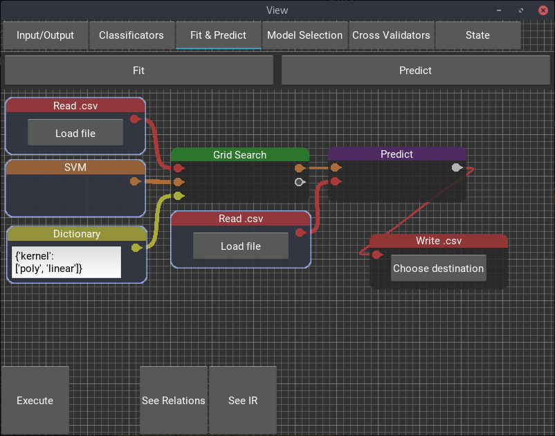
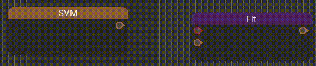
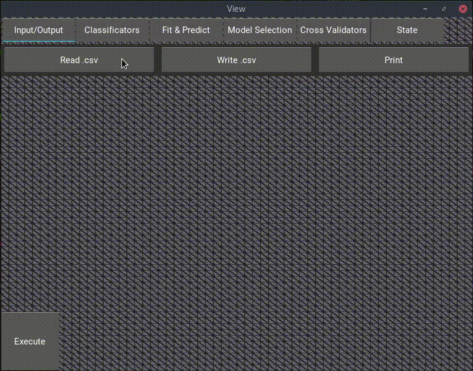

Persimmon    
===================

What is it?
-----------
Persimmon is a visual dataflow language for creating sklearn pipelines.

It represents functions as blocks, inputs and outputs are presented as pins,
and type safety is enforced when the connection is being made.

A smart bubble helps suggesting suitable context-sensitive blocks when making
a connection, showing only the blocks which are type safe.
There is also a search box that can be used for finding a particular block.

How to install?
---------------
If you have pip (Python 3.5+) you can simply type

`$> pip install persimmon`

To execute use.

`$> python -m persimmon`

For windows self-contained executables can be found on the [releases page].

[releases page]: https://github.com/AlvarBer/Persimmon/releases
