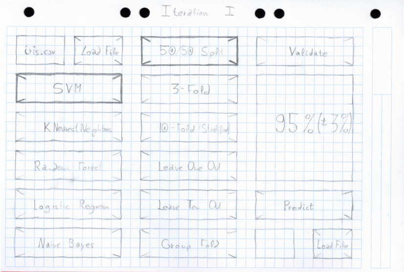
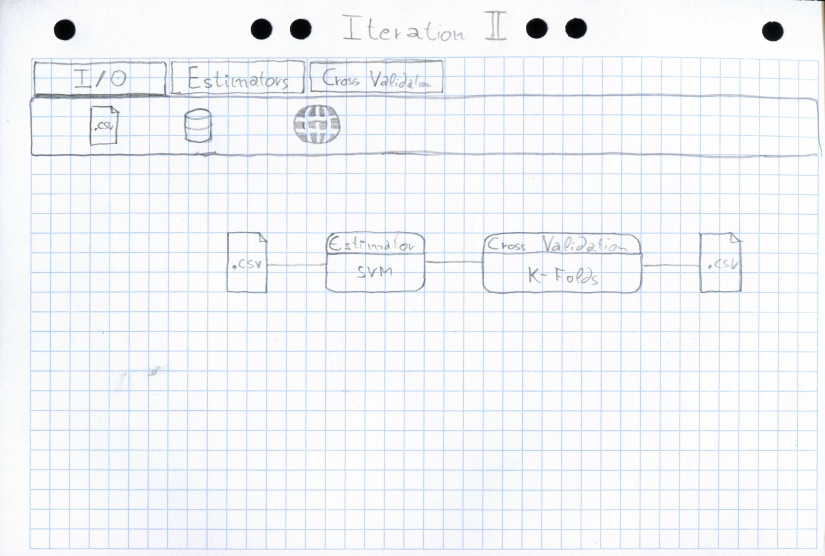

Implementation
==============

First Iteration
---------------

For the first iteration the priority was to get a proof of concept in order to
see where the difficulties can appear, with a few simple classifiers and
cross-validation techniques.

The chosen classifiers were simple and well-understood methods such as K-Nearest
Neighbors, Logistic Regression, Naive Bayes, Support Vector Machines and Random
Forest, which a slightly more complex method that involves ensemble of Decision
Trees, but gives good results in wide variety of problems.

Apart from the temporary interface the backend had to be built, because only
the simplest workflows were being supported no remarkable difficulties were
found. However estimators were limited to classifiers only, as including
regressors and clusterings complicated things since interfaces are not
compatible.

Second Iteration
----------------

For the second interface the drag and drop feel was the main priority.

Third Iteration
---------------

