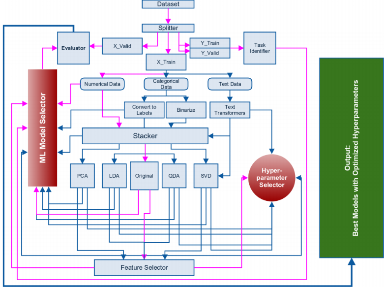

Workflows
=========

What is a workflow on this context? When we talk about workflow we refer to
the typical ML exploratory work analysis, i.e. the possible pipelines we use
early on the project when we still do not know what strategies will work best
for the data.

Simple
------
The simplest workflows are those that involve no preprocessing, no adjustment,
and just either test how good the model works (validate) or predict using both
the train file and another file without class feature.

Regular
-------
A more usual workflow involves also tunning the hyper-parameters of the
selected hyper-parameters, this involves making a grid of the possible
hyper-parameters and trying all of them, resulting in finding the best
possible value.

Complex
-------
More complex workflows that are out of our scope involve preprocessing, this
varies wildly on a case by case basis, and can involve data cleaning, feature
engineering (such as combining two features into one) or dimensionality
reduction.

A extreme example can be seen in [@automatic], of course this kind of workflow
is out of scope for us, as this is far away from exploratory work, nevertheless
is a good examples on how complex can a Machine Learning workflow can be.

